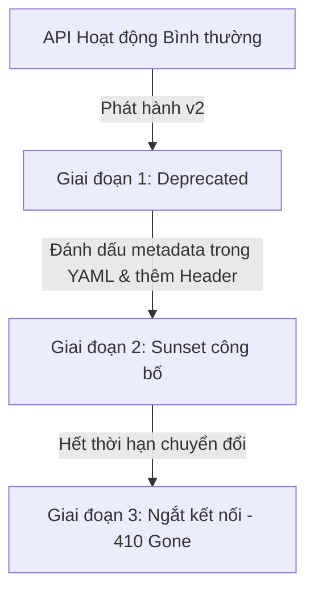

# API Versioning Strategy — Smart Campus Operations Platform

Tài liệu này đặc tả chiến lược quản lý phiên bản (Versioning), lộ trình dừng hỗ trợ phiên bản cũ (Deprecation & Sunset) và cách thức bảo đảm khả năng tương thích ngược (Backward Compatibility) của các dịch vụ API thuộc nền tảng Smart Campus Operations Platform.

---

## 1. Nguyên tắc cốt lõi về Versioning

Nền tảng Smart Campus áp dụng giải pháp **Path-based Versioning** (Phiên bản hóa dựa trên đường dẫn URL).

### Cấu trúc URL
```text
https://api.campus.local/v1/alerts
https://api.campus.local/v1/events
```
- **Lý do lựa chọn**:
  - Dễ cấu hình định tuyến (Routing) ở mức API Gateway (Kong/APISIX).
  - Tách biệt mã nguồn ứng dụng ở các thư mục điều phối (Controller) riêng biệt.
  - Hỗ trợ tốt nhất cho cơ chế cache của trình duyệt và CDN (vì URL là duy nhất cho mỗi tài nguyên ở từng phiên bản).

---

## 2. Phân loại các thay đổi trong API

Để đảm bảo các Consumer tích hợp không bị gián đoạn hoạt động, hệ thống phân chia các thay đổi API làm hai loại chính:

### 2.1. Thay đổi tương thích ngược (Backward-Compatible Changes)
*Là các thay đổi KHÔNG làm hỏng mã nguồn đang chạy của Consumer hiện tại. Các thay đổi này có thể deploy trực tiếp lên phiên bản hiện hành (`/v1`) mà không cần nâng số phiên bản.*

- **Các trường hợp cụ thể**:
  - Thêm một endpoint mới hoàn toàn (ví dụ: `GET /alerts/statistics`).
  - Thêm một thuộc tính tùy chọn (optional field) mới vào JSON Response.
  - Thêm một tham số tùy chọn (optional query parameter) mới vào HTTP Request.
  - Thay đổi thứ tự sắp xếp các thuộc tính trong JSON Response (Consumer bắt buộc phải sử dụng thư viện parse JSON theo Key chứ không parse theo Index).

### 2.2. Thay đổi gây lỗi tích hợp (Breaking Changes / Non-Compatible)
*Là các thay đổi làm phá vỡ hoặc gây lỗi biên dịch/chạy ứng dụng ở Consumer hiện tại. Các thay đổi này BẮT BUỘC phải đi kèm với việc phát hành một phiên bản API mới (ví dụ: nâng cấp lên `/v2`).*

- **Các trường hợp cụ thể**:
  - Xóa bỏ một endpoint đang tồn tại hoặc thay đổi phương thức HTTP (ví dụ: chuyển từ `POST` sang `PUT`).
  - Xóa bỏ hoặc đổi tên một thuộc tính bắt buộc (required field) trong JSON Response hoặc Request payload.
  - Thay đổi kiểu dữ liệu (data type) của một thuộc tính (ví dụ: từ `integer` sang `string`, hoặc thay đổi định dạng từ regex mã thẻ RFID cũ sang regex mới).
  - Thêm một thuộc tính bắt buộc mới vào Request payload mà không có giá trị mặc định (default value).
  - Thay đổi quy ước phản hồi mã lỗi (ví dụ: trước đây lỗi validation trả về 400 Bad Request, nay đổi thành 422 Unprocessable Entity).

---

## 3. Quy trình Vô hiệu hóa API (Deprecation & Sunset Flow)

Khi một phiên bản API cũ (ví dụ: `/v1`) được lên kế hoạch thay thế bởi phiên bản mới (`/v2`), hệ thống sẽ thực thi quy trình gỡ bỏ gồm 3 giai đoạn:



### Giai đoạn 1: Đánh dấu Deprecated trong Hợp đồng OpenAPI
Trong `openapi.yaml`, mọi endpoint thuộc phiên bản cũ cần dừng hỗ trợ sẽ được cấu hình thuộc tính `deprecated: true` ở cấp độ Operation.
*Ví dụ cấu hình*:
```yaml
  /alerts/recent:
    get:
      operationId: getRecentAlerts
      deprecated: true
      summary: Lấy các cảnh báo gần đây (Đã lỗi thời)
```

### Giai đoạn 2: Gửi phản hồi kèm các HTTP Header chỉ báo
Khi Consumer gọi vào API đã bị đánh dấu Deprecated, server vẫn xử lý yêu cầu bình thường nhưng bắt buộc phải trả về hai HTTP Header tiêu chuẩn trong Response:
1. **`Deprecation`**: Chỉ ra thời điểm API bắt đầu bị coi là lỗi thời hoặc đơn giản là khẳng định API đã lỗi thời (chứa giá trị `true` hoặc ngày tháng).
   `Deprecation: true` hoặc `Deprecation: @"2026-05-01"`
2. **`Sunset`**: Chỉ ra thời hạn cuối cùng mà API này sẽ chính thức bị tắt (ngắt kết nối hoàn toàn). Giá trị là định dạng thời gian chuẩn HTTP (RFC 7231).
   `Sunset: Sun, 31 May 2026 23:59:59 GMT`

### Giai đoạn 3: Chính thức ngắt kết nối (End of Life)
Sau thời điểm ghi nhận trong header `Sunset`, API Gateway sẽ cấu hình từ chối mọi yêu cầu gửi tới endpoint cũ và trả về mã lỗi **`410 Gone`** kèm theo Problem Details chỉ hướng dẫn Consumer chuyển sang sử dụng `/v2`.

---

## 4. Kịch bản Áp dụng Thực tế trong Lab 02

### Ví dụ áp dụng Cursor-based Pagination
Để hạn chế việc thay đổi đột ngột gây lỗi (Breaking change), hai endpoint trả về danh sách lớn trong Smart Campus là `GET /alerts` và `GET /events` được thiết kế ngay từ đầu với cơ chế Cursor-based để tránh trường hợp sau này phải nâng cấp lên `/v2` khi lượng dữ liệu phình to.

### Ví dụ áp dụng Webhook
Để tránh việc các Consumer liên tục gọi GET (polling) gây quá tải băng thông cho server trung tâm, hệ thống cung cấp Webhook `alertCreated` để tự động đẩy sự kiện khẩn cấp tới Consumer.
Nếu Consumer không kịp nâng cấp hệ thống để dựng cổng nhận Webhook, họ vẫn có thể tạm thời sử dụng API `/alerts/recent` nhưng API này đã được đánh dấu là có hiệu năng kém và sẽ sớm bị `deprecated` trong tương lai gần.
